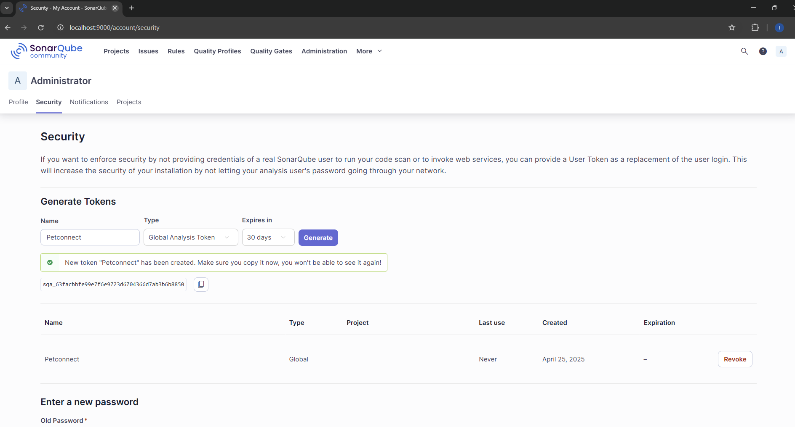

# PetConnect Project

[](README_ES.md)

Comprehensive digital platform for animal health management, featuring digital vaccination certificates, medical records, online appointments, and vet communication. This monorepo contains the backend (Java/Spring Boot) and frontend (React/TypeScript).

<!-- TODO: Add a screenshot of the running application here -->
<!--  -->

## Table of Contents
- [1. Prerequisites](#1-prerequisites)
- [2. Clone repository](#2-clone-repository)
- [3. Initial configuration: Environment variables](#3-initial-configuration-environment-variables)
  - [3.1 Generating signing keys (If they don't exist)](#31-generating-signing-keys-if-they-dont-exist)
- [4. Build and start the full development environment](#4-build-and-start-the-full-development-environment)
- [5. Build the backend locally  (Manual - Optional for IDE/Debug)](#5-running-backend-locally-idedebug-alternative)
- [6. Running tests](#6-running-tests)
- [7. Run the frontend (Development mode)](#7-run-the-frontend-development-mode)
- [8. Accessing tools & applications](#8-accessing-tools--applications)
- [9. Running SonarQube analysis](#9-running-sonarqube-analysis)
- [10. Testing the API with Postman](#10-testing-the-api-with-postman)

## 1. Prerequisites

Ensure you have the following software installed on your system:

*   **Git:** For cloning the repository and version control ([https://git-scm.com/](https://git-scm.com/)).
*   **Java JDK 21:** Or a compatible version ([https://adoptium.net/](https://adoptium.net/)). Verify with `java -version`.
*   **Apache Maven:** For building the backend project ([https://maven.apache.org/](https://maven.apache.org/)). Verify with `mvn -version`. Ensure it's added to your system's PATH.
*   **Node.js & npm:** For managing frontend dependencies and running the frontend project (LTS version recommended - [https://nodejs.org/](https://nodejs.org/)). Verify with `node -v` and `npm -v`.
*   **Docker & Docker Compose:** For running containerized services (Database, SonarQube) ([https://www.docker.com/products/docker-desktop/](https://www.docker.com/products/docker-desktop/)). Verify with `docker --version` and `docker-compose --version` (or `docker compose version`).
*   **Docker Desktop (includes Docker Compose v2):** For running containerized services (Database, SonarQube) ([https://www.docker.com/products/docker-desktop/](https://www.docker.com/products/docker-desktop/)).

**Recommended Tools:**

*   An IDE like IntelliJ IDEA or VS Code for code editing and debugging.
*   Postman or a similar tool for API testing ([https://www.postman.com/downloads/](https://www.postman.com/downloads/)).

## 2. Clone repository

```bash
git clone https://github.com/i-bosquet/petconnect.git
cd petconnect
```

## 3. Initial configuration: Environment variables
Before running the application, you need to set up environment variables.

- **Create `.env` file**: This file is **NOT** included in the repository for security reasons. You must create it manually in the project root (`petconnect/`) with the following exact content:
```bash
# --- Database Configuration ---
# Used by Docker Compose and Backend Application (via environment variables)
POSTGRES_DB=petconnect_db
POSTGRES_USER=root
POSTGRES_PASSWORD=1234 # Change this if you want a more secure password!

# --- SonarQube Analysis ---
# Used by the analysis scripts (run-sonar-analysis.ps1 / .sh)
# Generate a token in your SonarQube instance (http://localhost:9000)
# Go to: Account -> My Account -> Security -> Generate Tokens
SONAR_TOKEN=YOUR_SONARQUBE_TOKEN_HERE
# --- JWT Security ---
# Generate a secure secret key (e.g., using 'openssl rand -hex 32')
JWT_SECRET_KEY=YOUR_SECURE_JWT_SECRET_KEY_HERE_REPLACE_ME_PLEASE
# Issuer name for the token (optional, can be your app name)
JWT_SECRET_GENERATOR=PetConnectApp

# --- Digital Signature Keys (Paths relative to project root) ---
# Ensure the .pem files exist in the 'keys/' directory.
# See section '3.1 Generating Signing Keys' if they don't exist.
VET_KEY_PATH=../keys/vet_private_key.pem
VET_KEY_PASSWORD=1234 # IMPORTANT: Change this default password!
CLINIC_KEY_PATH=../keys/clinic_private_key.pem
CLINIC_KEY_PASSWORD=1234 # IMPORTANT: Change this default password!
```


> [!IMPORTANT]
> Replace `YOUR_SONARQUBE_TOKEN_HERE` with a real token generated from your local SonarQube instance once it's running.

## 3.1 Generating signing keys (If they don't exist)

The application uses RSA keys for digital signatures. For the development environment, you might need to generate test keys using OpenSSL. If the files `keys/vet_private_key.pem`, `keys/vet_public_key.pem`, `keys/clinic_private_key.pem`, and `keys/clinic_public_key.pem` do not exist, create them by running the following commands from the project root (`petconnect/`). Ensure OpenSSL is installed.

- Create the `keys` directory if it doesn't exist:
```bash
mkdir keys
```
- Generate the Veterinarian's private key (encrypted):
(You will be prompted for the password defined in VET_KEY_PASSWORD in your .env file - default '1234')

```bash
# Replace '1234' if you changed VET_KEY_PASSWORD in .env
openssl genpkey -algorithm RSA -spi keys/vet_private_key.pem -aes256 -pass pass:1234 -pkeyopt rsa_keygen_bits:2048
```
- Extract the Veterinarian's public key:
(You will be prompted for the private key password)
```bash
# Replace '1234' if you changed VET_KEY_PASSWORD in .env
openssl rsa -pubout -in keys/vet_private_key.pem -spi keys/vet_public_key.pem -passin pass:1234
```
- Generate the Clinic's private key (encrypted):
(You will be prompted for the password defined in CLINIC_KEY_PASSWORD in your .env file - default '1234')
```bash
# Replace '1234' if you changed CLINIC_KEY_PASSWORD in .env
openssl genpkey -algorithm RSA -spi keys/clinic_private_key.pem -aes256 -pass pass:1234 -pkeyopt rsa_keygen_bits:2048
```
- Extract the Clinic's public key:
(You will be prompted for the private key password)
```bash
# Replace '1234' if you changed CLINIC_KEY_PASSWORD in .env
openssl rsa -pubout -in keys/clinic_private_key.pem -spi keys/clinic_public_key.pem -passin pass:1234
```
> [!NOTE]
> On Windows using Git Bash, you might need to prefix the openssl commands with winpty. 
> These keys are for development and testing only. 
> **Never use these keys or this method in production**.


## 4. Build and start the full development environment
Docker Compose is used to orchestrate all the necessary services (database, backend, analysis tools, etc.). This is the standard way to run the application for development and testing.

1.  **Ensure Prerequisites Met:** Make sure you have completed steps 1-4 (Prerequisites, Clone, `.env` Setup, Key Generation if needed).
2.  **Build and Start All Services:** From the project root directory (`petconnect/`), run the following single command:
    ```bash
    docker compose up --build -d
    ```

This command will download the necessary images (if not present) and create/start the following containers in detached mode (`-d`):
-   `petconnect_db`: PostgreSQL database container.
-   `petconnect_adminer`: Web interface for database management.
-   `petconnect_backend`: Spring Boot backend application container.
-   `petconnect_sonarqube`: SonarQube server container.
-   `petconnect_zookeeper`: Zookeeper container (for Kafka).
-   `petconnect_kafka`: Kafka broker container (for asynchronous events).

3.  **Verify All Containers:** Check that all expected containers are running:
    ```bash
    docker compose ps
    ```
    You should see `petconnect_db`, `petconnect_adminer`, `petconnect_backend`, `petconnect_sonarqube`, `petconnect_zookeeper`, and `petconnect_kafka` listed as 'running' or 'up.'


4.  **Check Backend Logs:** If needed, view the backend logs to confirm a successful startup:
    ```bash
    docker compose logs -f backend
    ```

All services should now be running and accessible at the ports defined in Section 8 (Accessing Tools & Applications). The backend API is at `http://localhost:8080`.

> [!NOTE]
> *   To stop all running services: `docker compose down`
> *   To restart services: `docker compose restart` (or restart specific ones like `docker compose restart backend`)


 

## 5. Running backend locally (IDE/Debug Alternative)

While Section 4 describes running the full environment via Docker Compose, you might prefer to run or debug the backend application directly from your IDE (like IntelliJ or VS Code) or using the Maven Spring Boot plugin for faster feedback loops during development, while still using the containerized database and analysis tools

**Prerequisites for this method:**

1.  **Database & Other Services Running:** You *must* have the necessary external services running in Docker. Start *at least* the database (and optionally Adminer, SonarQube if testing locally) if they aren't already running:
    ```bash
     # Ensure you are in the project root directory (petconnect/)
    docker compose up -d db adminer sonarqube # Add zookeeper kafka if needed for specific tests, but usually not for local backend run
    ```
    Your locally running backend will connect to this container via `localhost:5432` (as defined in `backend/src/main/resources/application.properties`).


2.  **Backend Built (Optional but Recommended):** While `mvn spring-boot:run` can compile on the fly, ensuring the project is built cleanly beforehand can prevent issues:
    ```bash
    cd backend
    mvn clean package -DskipTests
    # cd .. # Go back to project root
    ```

**Running the Backend Locally:**

*   **Option A: Using Maven Spring Boot Plugin:**
    In a terminal within the `petconnect/backend/` directory, run:
    ```bash
    mvn spring-boot:run
    ```

*   **Option B: Using an IDE:**
  *   Import the `backend` folder as a Maven project in your IDE.
  *   Locate the `com.petconnect.backend.BackendApplication` class.
  *   Run or Debug this class directly from the IDE. The IDE will typically handle the build process.

The backend API will be available at `http://localhost:8080`, connecting to the database running in the `petconnect_db` Docker container.

> [!IMPORTANT]
> 
> This method runs the backend application **outside** its own Docker container, directly on your host machine. It relies on having the correct Java and Maven versions installed locally (see Section 1).
> 
>**Note:** When running locally, the backend will connect to the containerized database via `localhost:5432`. 
> However, it **will not** be able to connect to the containerized Kafka broker using the internal hostname `kafka:9092` specified in `application.properties`. For full functionality including asynchronous event publishing/consumption testing, use the complete Docker Compose environment (Section 4).

## 6. Running tests

This project includes a comprehensive suite of unit and integration tests. To run all tests for the backend:

 **Ensure Docker services are running:** Integration tests require the database container (`petconnect_db`) to be active. Start it if needed: `docker compose up -d db`

**Run tests using Maven:** The `verify` lifecycle phase will compile code and execute both unit and integration tests. 
In the `petconnect/backend/` directory run:

```bash
    mvn clean verify
```
### View Reports: 
Open the following files in your web browser:
- Unit Test Report: `backend/target/site/surefire-report.html`
- Code Coverage Report: `backend/target/site/jacoco/index.html`

> [!NOTE]
> The command in the "Build the Backend" section (`mvn clean install -DskipTests`) explicitly skips tests to speed up the build process if you only need the application package. The `mvn clean verify` command is the standard way to run the full test suite.

> [!INFO] Comprehensive Analysis (including tests & coverage): Use the SonarQube dashboard (see Section 10).


## 7. Run the frontend (Development Mode)
- Open a terminal in the `petconnect/frontend/` directory.
- Install dependencies (only needed the first time or after updates):
```bash
npm install
```
- Start the development server:
```bash
npm run dev
```
- Vite will start the development server.
Open your web browser to the URL provided http://localhost:5173.

## 8. Accessing tools & applications
- Once everything is running:
- Frontend Application: http://localhost:5173
- Backend API Base URL: http://localhost:8080
- Swagger UI (API Docs): http://localhost:8080/swagger-ui.html


- SonarQube Server: http://localhost:9000 (Initial login: admin / admin - Change it!)

<!--  -->

- Adminer (DB Management): http://localhost:8081
  - System: PostgreSQL
  - Server: petconnect_db (The service name/container name)
  - Username: root (from  `.env` file)
  - Password: 1234 (from  `.env` file)
  - Database: petconnect_db (from `.env` file)

<!--  -->


## 9. Running SonarQube analysis
- Ensure you have generated a SonarQube token and added it to your .env file (Step 3).
- Open a terminal in the project root (`petconnect/`).
- Navigate to the `scripts/` directory: `cd scripts`
- Execute the script appropriate for your operating system:
  - Windows (PowerShell): `.\run-sonar-analysis.ps1`
  - Linux / macOS (Bash): `bash run-sonar-analysis.sh` (or `./run-sonar-analysis.sh` after `chmod +x run-sonar-analysis.sh`)
*   **Analysis Results:** As shown in the screenshot, the analysis provides detailed metrics on code quality. The project currently achieves **86.3%** code coverage via unit and integration tests, successfully passing the default **SonarQube Quality Gate**. This coverage level focuses on the core business logic within services, controllers, and helpers, while appropriately excluding data structures (models, DTOs), configuration classes, and exceptions.
*   You can view the detailed report, including code coverage breakdown, issues, and quality gate status, on your local SonarQube server at `http://localhost:9000/dashboard?id=petconnect_backend`.

  


## 10. Testing the API with Postman
- Open Postman.
- Import the collection: "File" > "Import..." and select the `postman/PetConnect.postman_collection.json` file.
- Import the environment: "File" > "Import..." and select the `postman/PetConnect_Local_Dev.postman_environment.json` file.
- Ensure the `PetConnect Local Dev` environment is selected in the top-right corner.
- You can now explore the folders and execute requests against your locally running backend (http://localhost:8080).


---
*Para obtener instrucciones en español, consulte [README_ES.md](README_ES.md).*