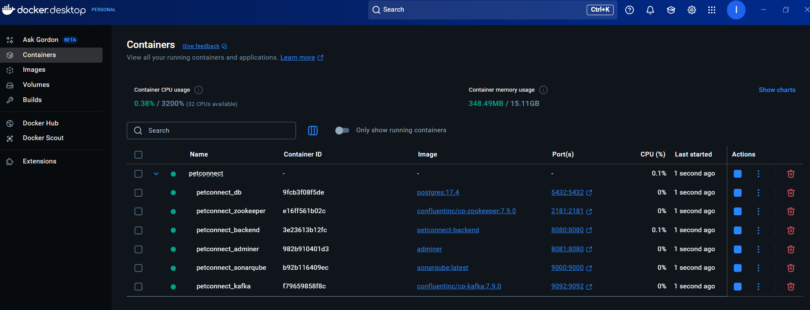

# PetConnect Project

[](README_ES.md)

Comprehensive digital platform for animal health management, featuring digital vaccination certificates, medical records, online appointments, and vet communication. This monorepo contains the backend (Java/Spring Boot) and frontend (React/TypeScript).

<!-- TODO: Add a screenshot of the running application here -->
<!--  -->

## 1. Prerequisites

Ensure you have the following software installed on your system:

*   **Git:** For cloning the repository and version control ([https://git-scm.com/](https://git-scm.com/)).
*   **Java JDK 21:** Or a compatible version ([https://adoptium.net/](https://adoptium.net/)). Verify with `java -version`.
*   **Apache Maven:** For building the backend project ([https://maven.apache.org/](https://maven.apache.org/)). Verify with `mvn -version`. Ensure it's added to your system's PATH.
*   **Node.js & npm:** For managing frontend dependencies and running the frontend project (LTS version recommended - [https://nodejs.org/](https://nodejs.org/)). Verify with `node -v` and `npm -v`.
*   **Docker & Docker Compose:** For running containerized services (Database, SonarQube) ([https://www.docker.com/products/docker-desktop/](https://www.docker.com/products/docker-desktop/)). Verify with `docker --version` and `docker-compose --version` (or `docker compose version`).

**Recommended Tools:**

*   An IDE like IntelliJ IDEA or VS Code for code editing and debugging.
*   Postman or a similar tool for API testing ([https://www.postman.com/downloads/](https://www.postman.com/downloads/)).

## 2. Clone Repository

```bash
git clone https://github.com/i-bosquet/petconnect.git
cd petconnect
```

## 3. Initial Configuration: Environment Variables
Before running the application, you need to set up environment variables.

- **Create `.env` file**: This file is **NOT** included in the repository for security reasons. You must create it manually in the project root (`petconnect/`) with the following exact content:
```bash
# --- Database Configuration ---
# Used by Docker Compose and Backend Application (via environment variables)
POSTGRES_DB=petconnect_db
POSTGRES_USER=root
POSTGRES_PASSWORD=1234 # Change this if you want a more secure password!

# --- SonarQube Analysis ---
# Used by the analysis scripts (run-sonar-analysis.ps1 / .sh)
# Generate a token in your SonarQube instance (http://localhost:9000)
# Go to: Administration -> Security -> Users -> Tokens (for your user) -> Generate Tokens
SONAR_TOKEN=YOUR_SONARQUBE_TOKEN_HERE
```
> [!IMPORTANT]
> Replace `YOUR_SONARQUBE_TOKEN_HERE` with a real token generated from your local SonarQube instance once it's running (see Step 4).

## 4. Start Containerized Services
Open a terminal in the project root (petconnect/) and run:
```bash
docker-compose up -d
```

This command will download the necessary images (if not present) and create/start the following containers in detached mode (`-d`):
- `petconnect_db`: PostgreSQL 17.4 database container.
- `petconnect_adminer`: Web interface for database management.
- `petconnect_sonarqube`: SonarQube server container.

You can verify the containers are running with:
```bash
docker ps
```
<!-- TODO: Add a screenshot of 'docker ps' output -->
<!--  -->

## 5. Build the Backend
Open a terminal in the project root (`petconnect/`) and navigate to the backend directory. Then, build the project using Maven:
```bash
cd backend
mvn clean install -DskipTests 
# -DskipTests is optional, speeds up build if you don't need to run tests yet
# On subsequent builds, 'mvn package' might be sufficient if dependencies haven't changed
cd .. 
# Go back to root directory
```

This will compile the Java code, download dependencies, and package the application (usually as a JAR file in the `backend/target` directory).

## 6. Run the Backend (Development Mode)
Ensure the Docker containers (especially the database `petconnect_db`) are running (Step 4).
- **Using Maven Spring Boot Plugin (Recommended for Terminal):**
Open a terminal in the `petconnect/backend/` directory and run:
```bash
mvn spring-boot:run
```
The Spring Boot application will start, connect to the database container, and become available at `http://localhost:8080`.

- Using an IDE (Alternative):
  - Import the backend folder as a Maven project in your preferred IDE (IntelliJ IDEA, Eclipse, VS Code with Java extensions).
  - Locate the `com.petconnect.backend.BackendApplication` class.
  - Run this class directly from the IDE.

## 7. Run the Frontend (Development Mode)
- Open a terminal in the `petconnect/frontend/` directory.
- Install dependencies (only needed the first time or after updates):
```bash
npm install
```
- Start the development server:
```bash
npm run dev
```
- Vite will start the development server.
Open your web browser to the URL provided http://localhost:5173.

## 8. Accessing Tools & Application
- Once everything is running:
- Frontend Application: http://localhost:5173
- Backend API Base URL: http://localhost:8080
- Swagger UI (API Docs): http://localhost:8080/swagger-ui.html
- SonarQube Server: http://localhost:9000 (Initial login: admin / admin - Change it!)
- Adminer (DB Management): http://localhost:8081
  - System: PostgreSQL
  - Server: petconnect_db (The service name/container name)
  - Username: root (from  `.env` file)
  - Password: 1234 (from  `.env` file)
  - Database: petconnect_db (from `.env` file)

<!-- TODO: Add screenshots of Swagger UI, SonarQube, Adminer login -->
<!--  -->
<!--  -->


## 9. Running SonarQube Analysis
- Ensure you have generated a SonarQube token and added it to your .env file (Step 3).
- Open a terminal in the project root (`petconnect/`).
- Navigate to the `scripts/` directory: `cd scripts`
- Execute the script appropriate for your operating system:
  - Windows (PowerShell): `.\run-sonar-analysis.ps1`
  - Linux / macOS (Bash): `bash run-sonar-analysis.sh` (or `./run-sonar-analysis.sh` after `chmod +x run-sonar-analysis.sh`)
- Maven will build the project, run tests (generating Jacoco reports), and send the analysis results to the SonarQube server. 
- You can view the report at http://localhost:9000.

## 10. Testing the API with Postman
- Open Postman.
- Import the collection: "File" > "Import..." and select the `postman/PetConnect.postman_collection.json` file.
- Import the environment: "File" > "Import..." and select the `postman/PetConnect_Local_Dev.postman_environment.json` file.
- Ensure the `PetConnect Local Dev` environment is selected in the top-right corner.
- You can now explore the folders and execute requests against your locally running backend (http://localhost:8080).

<!-- TODO: Add a screenshot of Postman with the imported collection/environment -->
<!--  -->

---
*Para obtener instrucciones en español, consulte [README_ES.md](README_ES.md).*