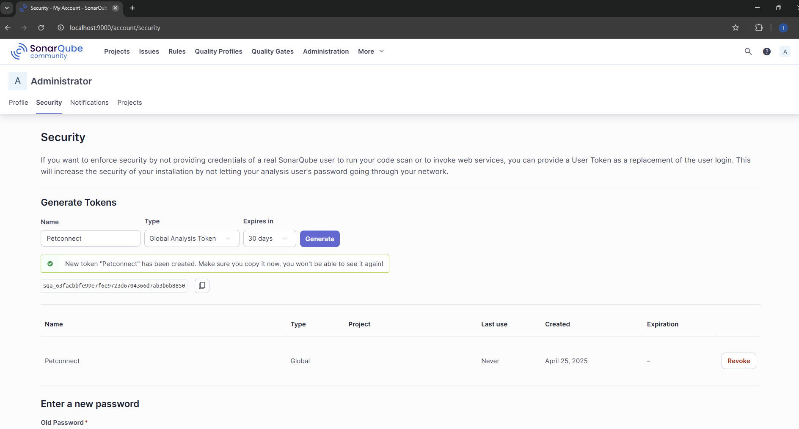
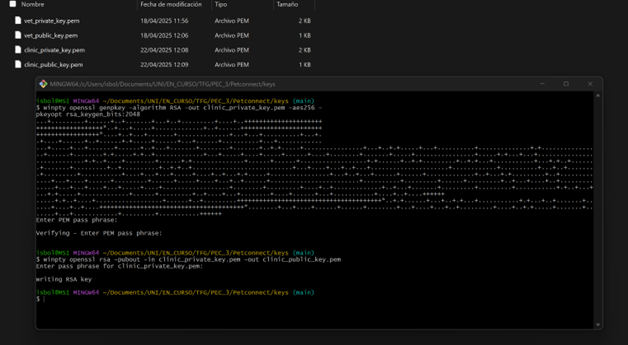
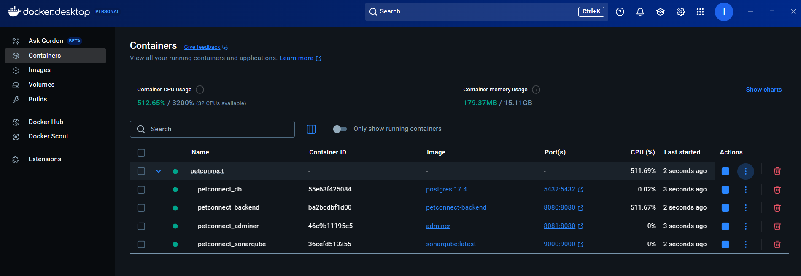
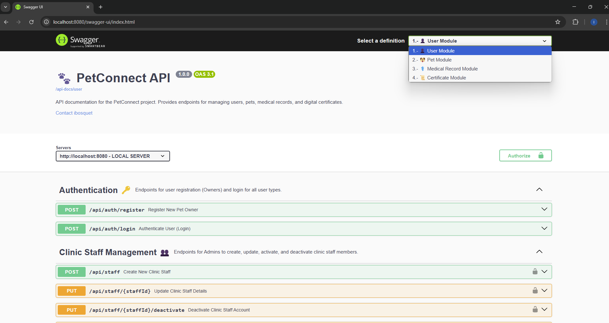
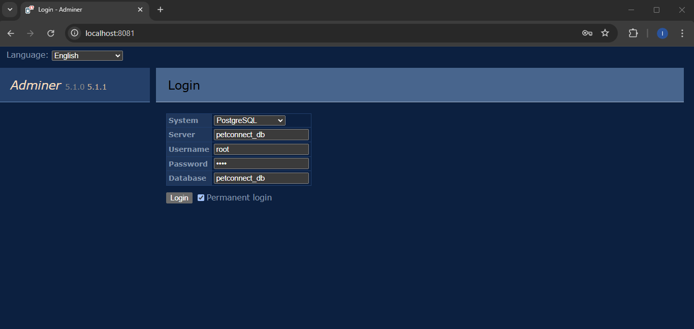
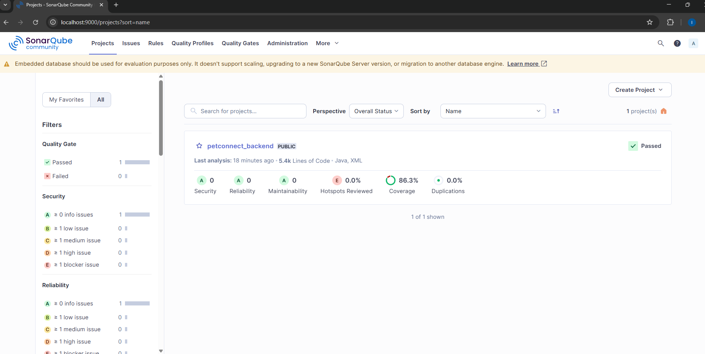
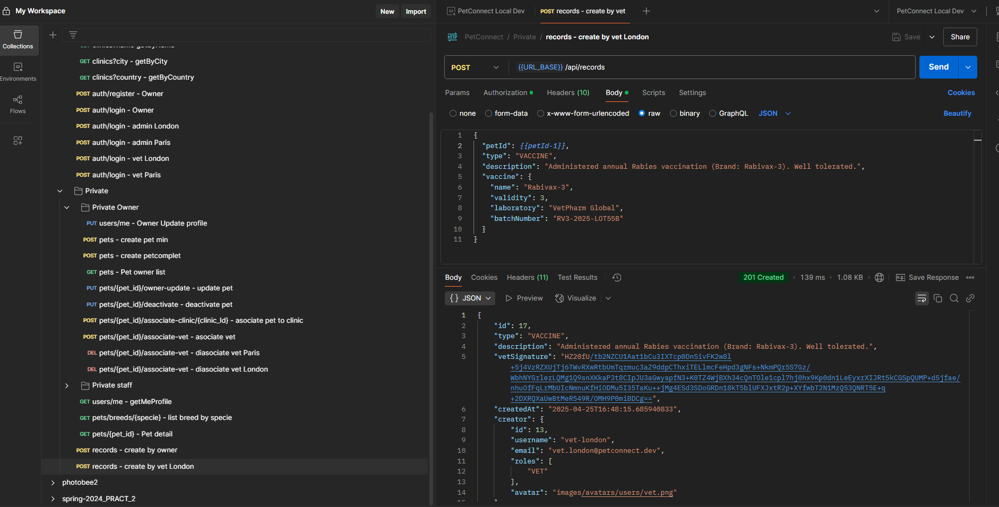

# Proyecto PetConnect 

[](README.md)

Plataforma digital integral para la gestión de la salud animal, incluyendo certificación digital de vacunación, historiales médicos, citas online y comunicación veterinaria. Este monorepo contiene el backend (Java/Spring Boot) y el frontend (React/TypeScript).

<!-- TODO: Añadir captura de pantalla de la aplicación funcionando aquí -->
<!--  -->

## Índice
- [1.Prerrequisitos](#1-prerrequisitos)
- [2. Clonar el repositorio](#2-clonar-el-repositorio)
- [3. Configuración Inicial: Variables de Entorno](#3-configuración-inicial-variables-de-entorno)
    - [3.1 Generación de Claves de Firma (Si no existen)](#31-generación-de-claves-de-firma-si-no-existen)
- [4. Construir e iniciar el entorno de desarrollo completo](#4-construir-e-iniciar-el-entorno-de-desarrollo-completo)
- [5. Construir el backend (Manual - Opcional para IDE/Debug)](#5-construir-el-backend-manual---opcional-para-idedebug)
- [6. Ejecutar pruebas (Tests)](#6-ejecutar-pruebas-tests)
- [7. Ejecutar el frontend (Modo desarrollo)](#7-ejecutar-el-frontend-modo-desarrollo)
- [8. Acceder a las herramientas y aplicación](#8-acceder-a-las-herramientas-y-aplicación)
- [9. Ejecutar análisis con SonarQube](#9-ejecutar-análisis-con-sonarqube)
- [10. Probar la API con Postman](#10-probar-la-api-con-postman)

## 1. Prerrequisitos

Asegúrate de tener instalado el siguiente software en tu sistema:

*   **Git:** Para clonar el repositorio y gestionar versiones ([https://git-scm.com/](https://git-scm.com/)).
*   **Java JDK 21:** O una versión compatible ([https://adoptium.net/](https://adoptium.net/)). Verifica con `java -version`.
*   **Apache Maven:** Para construir el proyecto backend ([https://maven.apache.org/](https://maven.apache.org/)). Verifica con `mvn -version`. Asegúrate de que esté añadido al PATH de tu sistema.
*   **Node.js & npm:** Para gestionar las dependencias y ejecutar el proyecto frontend (Se recomienda la versión LTS - [https://nodejs.org/](https://nodejs.org/)). Verifica con `node -v` y `npm -v`.
*   **Docker & Docker Compose:** Para ejecutar los servicios contenedorizados (Base de Datos, SonarQube) ([https://www.docker.com/products/docker-desktop/](https://www.docker.com/products/docker-desktop/)). Verifica con `docker --version` y `docker-compose --version` (o `docker compose version`).
*   **Docker Desktop (incluye Docker Compose v2):** Para ejecutar los servicios contenedorizados (Base de Datos, SonarQube) ([https://www.docker.com/products/docker-desktop/](https://www.docker.com/products/docker-desktop/)).

**Herramientas Recomendadas:**

*   Un IDE como IntelliJ IDEA o VS Code para editar código y depurar.
*   Postman o una herramienta similar para probar la API ([https://www.postman.com/downloads/](https://www.postman.com/downloads/)).

## 2. Clonar el repositorio


```bash
git clone https://github.com/i-bosquet/petconnect.git
cd petconnect
```

## 3. Configuración inicial: Variables de entorno
Antes de ejecutar la aplicación, necesitas configurar las variables de entorno.

- **Crear archivo `.env`**: Este archivo **NO** está incluido en el repositorio por seguridad. Debes crearlo manualmente en la raíz del proyecto (`petconnect/`) con el siguiente contenido exacto:
```bash
# --- Configuración Base de Datos ---
# Usado por Docker Compose y la Aplicación Backend (vía variables de entorno)
POSTGRES_DB=petconnect_db
POSTGRES_USER=root
POSTGRES_PASSWORD=1234 # ¡Cambia esto si quieres una contraseña más segura!

# --- Análisis SonarQube ---
# Usado por los scripts de análisis (run-sonar-analysis.ps1 / .sh)
# Genera un token en tu instancia de SonarQube (http://localhost:9000)
# Ve a: Account -> My Account -> Security -> Generate Tokens
SONAR_TOKEN=TU_TOKEN_DE_SONARQUBE_AQUI

# --- Claves de Firma Digital (Rutas relativas a la raíz del proyecto) ---
# Asegúrate de que los archivos .pem existan en el directorio 'keys/'.
# Consulta la sección '3.1 Generación de Claves de Firma' si no existen.
VET_KEY_PATH=../keys/vet_private_key.pem
VET_KEY_PASSWORD=1234 # IMPORTANTE: ¡Cambia esta contraseña por defecto!
CLINIC_KEY_PATH=../keys/clinic_private_key.pem
CLINIC_KEY_PASSWORD=1234 # IMPORTANTE: ¡Cambia esta contraseña por defecto!
```


> [!IMPORTANT]
> Reemplaza `TU_TOKEN_DE_SONARQUBE_AQUI` con un token real generado desde tu instancia local de SonarQube una vez que esté en ejecución.

## 3.1 Generación de claves de firma (Si no existen)

La aplicación utiliza claves RSA para firmas digitales. Para el entorno de desarrollo, puede que necesites generar claves de prueba usando OpenSSL. Si los archivos `keys/vet_private_key.pem`, `keys/vet_public_key.pem`, `keys/clinic_private_key.pem` y `keys/clinic_public_key.pem` no existen, créalos ejecutando los siguientes comandos desde la raíz del proyecto (`petconnect/`). Asegúrate de tener OpenSSL instalado.

- Crea el directorio `keys` si no existe:
```bash
mkdir keys
```
- Genera la clave privada del Veterinario (encriptada):
  (Se te pedirá la contraseña definida en VET_KEY_PASSWORD en tu archivo .env - por defecto '1234')

```bash
# Reemplaza '1234' si cambiaste VET_KEY_PASSWORD en .env
openssl genpkey -algorithm RSA -out keys/vet_private_key.pem -aes256 -pass pass:1234 -pkeyopt rsa_keygen_bits:2048
```
- Extrae la clave pública del Veterinario:
  (Se te pedirá la contraseña de la clave privada)
```bash
# Reemplaza '1234' si cambiaste VET_KEY_PASSWORD en .env
openssl rsa -pubout -in keys/vet_private_key.pem -out keys/vet_public_key.pem -passin pass:1234
```
- Genera la clave privada de la Clínica (encriptada):
  (Se te pedirá la contraseña definida en CLINIC_KEY_PASSWORD en tu archivo .env - por defecto '1234')
```bash
#  Reemplaza '1234' si cambiaste CLINIC_KEY_PASSWORD en .env
openssl genpkey -algorithm RSA -out keys/clinic_private_key.pem -aes256 -pass pass:1234 -pkeyopt rsa_keygen_bits:2048
```
- Extrae la clave pública de la Clínica:
  (Se te pedirá la contraseña de la clave privada)
```bash
#  Reemplaza '1234' si cambiaste CLINIC_KEY_PASSWORD en .env
openssl rsa -pubout -in keys/clinic_private_key.pem -out keys/clinic_public_key.pem -passin pass:1234
```
> [!NOTE]
> En Windows usando Git Bash, podrías necesitar prefijar los comandos openssl con winpty.
> Estas claves son solo para desarrollo y pruebas. 
> **Nunca uses estas claves o este método en producción**.

 

## 4. Construir e iniciar el entorno de desarrollo completo

Docker Compose se utiliza para orquestar todos los servicios necesarios (base de datos, backend, herramientas de análisis, etc.). Esta es la forma estándar de ejecutar la aplicación para desarrollo y pruebas.

1.  **Asegúrate de Cumplir los Prerrequisitos:** Verifica que has completado los pasos 1-4 (Prerrequisitos, Clonar, Configuración `.env`, Generación de Claves si fue necesario).
2.  **Construye e Inicia Todos los Servicios:** Desde el directorio raíz del proyecto (`petconnect/`), ejecuta el siguiente único comando:
    ```bash
    docker compose up --build -d
    ```

Este comando descargará las imágenes necesarias (si no las tienes) y creará e iniciará los siguientes contenedores en segundo plano (`-d`):
- `petconnect_db`: Contenedor con la base de datos PostgreSQL 17.4.
- `petconnect_adminer`: Interfaz web para gestionar la base de datos.
- `petconnect_sonarqube`: Contenedor con el servidor SonarQube.
- `petconnect_`backend``: Contenedor con el servidor Backend.

3.  **Verifica Todos los Contenedores:** Comprueba que todos los contenedores esperados están en ejecución:
    ```bash
    docker compose ps
    ```
    Deberías ver `petconnect_db`, `petconnect_adminer`, `petconnect_backend` y `petconnect_sonarqube` listados como 'running' o 'up'.

4.  **Revisa los Logs del Backend (Opcional):** Si es necesario, mira los logs del backend para confirmar un inicio correcto:
    ```bash
    docker compose logs -f backend
    ```

Todos los servicios deberían estar ahora ejecutándose y accesibles en los puertos definidos en la Sección 9 (Acceder a las Herramientas y Aplicación). La API del backend está en `http://localhost:8080`.

> [!NOTE]
> *   Para detener todos los servicios en ejecución: `docker compose down`
> *   Para reiniciar servicios: `docker compose restart` (o reiniciar servicios específicos como `docker compose restart backend`)





## 5. Ejecutar backend localmente (Alternativa IDE/Debug)

Aunque la Sección 4 describe cómo ejecutar el entorno completo vía Docker Compose, puede que prefieras ejecutar o depurar la aplicación backend directamente desde tu IDE (como IntelliJ o VS Code) o usando el plugin Maven de Spring Boot para obtener feedback más rápido durante el desarrollo, pero usando igualmente la base de datos contenerizada.

**Prerrequisitos para este método:**

1.  **Contenedor de Base de Datos en Ejecución:** Es **obligatorio** que el contenedor de la base de datos PostgreSQL esté ejecutándose. Inicia *solo* el servicio de base de datos (y opcionalmente Adminer) si no está ya iniciado:
    ```bash
    # Asegúrate de estar en el directorio raíz del proyecto (petconnect/)
    docker compose up -d db adminer
    ```
    Tu backend ejecutándose localmente se conectará a este contenedor vía `localhost:5432` (según se define en `backend/src/main/resources/application.properties`).

2.  **Backend Construido (Opcional pero Recomendado):** Aunque `mvn spring-boot:run` puede compilar al vuelo, asegurar que el proyecto está construido limpiamente de antemano puede prevenir problemas:
    ```bash
    cd backend
    mvn clean package -DskipTests
    # cd .. # Permanece en el directorio backend para el siguiente paso si usas Maven
    ```

**Ejecutar el Backend Localmente:**

*   **Opción A: Usando el Plugin Maven de Spring Boot:**
    En una terminal dentro del directorio `petconnect/backend/`, ejecuta:
    ```bash
    mvn spring-boot:run
    ```

*   **Opción B: Usando un IDE:**
    *   Importa la carpeta `backend` como un proyecto Maven en tu IDE.
    *   Localiza la clase `com.petconnect.backend.BackendApplication`.
    *   Ejecuta o Depura esta clase directamente desde el IDE. El IDE normalmente se encargará del proceso de construcción.

La API del backend estará disponible en `http://localhost:8080`, conectándose a la base de datos que se ejecuta en el contenedor Docker `petconnect_db`.

> [!IMPORTANT]
> Este método ejecuta la aplicación backend **fuera** de su propio contenedor Docker, directamente en tu máquina local. Depende de que tengas instaladas localmente las versiones correctas de Java y Maven (ver Sección 1). El método principal usando `docker compose up --build -d` (Sección 4) ejecuta el backend *dentro* de su contenedor, proporcionando una mayor consistencia de entorno.

## 6. Ejecutar pruebas (Tests)

Este proyecto incluye una suite completa de pruebas unitarias y de integración. Para ejecutar todas las pruebas del backend:

**Asegúrate de que los servicios Docker estén en ejecución:** Las pruebas de integración requieren que el contenedor de la base de datos (`petconnect_db`) esté activo. Inícialo si es necesario: `docker compose up -d db`

**Ejecuta las pruebas usando Maven:** La fase del ciclo de vida `verify` compilará el código y ejecutará tanto las pruebas unitarias como las de integración.
En el directorio `petconnect/backend/` ejecuta:
    
```bash
    mvn clean verify
```

### Ver Informes: 
Abre los siguientes archivos en tu navegador web:
- Informe Pruebas Unitarias: `backend/target/site/surefire-report.html`
- Informe Cobertura de Código: `backend/target/site/jacoco/index.html`

> [!NOTE]
> El comando en la sección "Construir el Backend" (`mvn clean install -DskipTests`) omite explícitamente las pruebas para acelerar el proceso de construcción si solo necesitas el paquete de la aplicación. El comando `mvn clean verify` es la forma estándar de ejecutar la suite completa de pruebas.

> [!INFO] Análisis Completo (incluye pruebas y cobertura): Usa el dashboard de SonarQube (ver Sección 10).


## 7. Ejecutar el frontend (Modo Desarrollo)

*   Abre una terminal en el directorio `petconnect/frontend/`.
*   **Instala dependencias (solo necesario la primera vez o tras actualizaciones):**
    ```bash
    npm install
    ```
*   **Inicia el servidor de desarrollo:**
    ```bash
    npm run dev
    ```
*   Vite iniciará el servidor de desarrollo. Abre tu navegador web en la URL indicada (normalmente `http://localhost:5173`).

## 8. Acceder a las herramientas y aplicación

Una vez todo esté en ejecución:

*   **Aplicación Frontend:** http://localhost:5173 (o el puerto que indique Vite)
*   **URL Base API Backend:** http://localhost:8080
*   **Swagger UI (Docs API):** http://localhost:8080/swagger-ui.html

    

*   **Servidor SonarQube:** http://localhost:9000 (Login inicial: admin / admin - ¡Cámbialo!)

*   **Adminer (Gestión BD):** http://localhost:8081
    *   Sistema: `PostgreSQL`
    *   Servidor: `petconnect_db` (Nombre del servicio/contenedor)
    *   Usuario: `root` (de tu archivo `.env`)
    *   Contraseña: `1234` (de tu archivo `.env`)
    *   Base de datos: `petconnect_db` (de tu archivo `.env`)



## 9. Ejecutar análisis con SonarQube

- Asegúrate de haber generado un token en SonarQube (http://localhost:9000) y haberlo añadido a tu archivo `.env` (Paso 3).
- Abre una terminal en la raíz del proyecto (`petconnect/`).
- Navega al directorio `scripts/`: `cd scripts`
- Ejecuta el script apropiado para tu sistema operativo:
    - **Windows (PowerShell):** `.\run-sonar-analysis.ps1`
    - **Linux / macOS (Bash):** `bash run-sonar-analysis.sh` (o `./run-sonar-analysis.sh` tras `chmod +x run-sonar-analysis.sh`)
*   **Resultados del Análisis:** Como muestra la captura de pantalla, el análisis proporciona métricas detalladas sobre la calidad del código. El proyecto alcanza actualmente una cobertura de código del **86.3%** mediante pruebas unitarias y de integración, superando con éxito el **"Quality Gate"** por defecto de SonarQube. Este nivel de cobertura se centra en la lógica de negocio principal dentro de los servicios, controladores y helpers, excluyendo apropiadamente estructuras de datos (modelos, DTOs), clases de configuración y excepciones.
*   Puedes ver el informe detallado, incluyendo el desglose de la cobertura, los issues y el estado del "Quality Gate", en tu servidor SonarQube local en `http://localhost:9000/dashboard?id=petconnect_backend`.


* 

## 10. Probar la API con Postman

-   Abre Postman.
-   Importa la colección: "Archivo" > "Importar..." y selecciona el archivo `postman/PetConnect.postman_collection.json`.
-   Importa el entorno: "Archivo" > "Importar..." y selecciona el archivo `postman/PetConnect_Local_Dev.postman_environment.json`.
-   Asegúrate de que el entorno "PetConnect Local Dev" está seleccionado en la esquina superior derecha.
-   Ahora puedes explorar las carpetas y ejecutar las peticiones contra tu backend local (http://localhost:8080).

 

---
*For English instructions, please see [README.md](README.md).*